# 🌌心智圖：經緯  {.appendix}

## SVG 版


## Mermaid 版 {caption="🌌心智圖"} 

::: {#fig-mindmap  caption="🌌心智圖"}  
```{mermaid}

%%{ init: { 'flowchart': { 'curve': 'bumpX' }, 'theme': 'redux', 'themeVariables': { 'lineColor': '#000', 'nodeBorder': '#000' } } }%%
graph LR
  
  C1b ~~~ INTRO ~~~ C2
  C1d ~~~ NOTES
  
  %% LLM 大語言模型
  C2f -.-> C2g 
  C2b -.-> C2g -.-> C4b 
  %%C4b -.-> C4f
  Situatedism ==> C7 

  C2b eC4@<==> C4
  eC4@{ animate: true }

  C2e -.-> C4 ~~~ C7a

  C3 ~~~ C3a
  %%   ROOT[📚 AI 知識地圖]
  %%   ROOT --> INTRO
  %%   ROOT --> NOTES
  %%   ROOT --> C1
  
  INTRO -.-> C2 & INTRO1 & C5 & INTRO2
  %% 導論
  INTRO[🤗💬 <br/>框智<br/>格局]
  INTRO@{ shape: subproc}
  INTRO1[🧠 <br/>心智能力<br/> 🐸🐘🧘]
  INTRO1@{ shape: subproc}
  INTRO2[🧠🧞‍♀️ <br/>〜語言賽局<br/>腦補機]
  INTRO2@{ shape: subproc}
  click INTRO1 "notes-mind.zh-hant.html"
  click INTRO2 "notes-mental_fill-in.zh-hant.html"
  %% 第壹篇
  C1[第壹篇 <br/>㉄ AI <br/>問題意識]
  C1a[1.1 🎭🗪 <br/>圖靈測試]
  C1b[1.2 🧱🗣️ <br/>中文房間]
  C1c[1.3 🔤⚓ <br/>符碼紮根問題]
  C1d[1.4 🖼️⏱️ <br/>框架問題]
  C1e[1.5 👁️⯊ <br/>完形心理]
  C1f[1.6 🎯🛡️ <br/>對齊與控制問題]
  C1g[1.7 🗫🎲 <br/>語言賽局]
  C1 --> C1a & C1b & C1c & C1d & C1e & C1f & C1g
  click C1 "01----problematics.zh-hant.html"
  click C1a "01-01-Turing_Test.zh-hant.html"
  click C1b "01-02-Chinese_Room.zh-hant.html"
  click C1c "01-03-Symbol_Grounding_Problem.zh-hant.html"
  click C1d "01-04-Frame_Problem.zh-hant.html"
  click C1e "01-05-Gestalt_Psychology.zh-hant.html"
  click C1f "01-06-Alignment_Control_Problem.zh-hant.html"
  click C1g "01-07-Language_Games.zh-hant.html"

  NOTES -.-> NOTES1 & NOTES2 & NOTES3 & C5 & INTRO2
  %% 筆記
  NOTES[📑 筆記]
  NOTES@{ shape: procs}
  NOTES1[🪜 <br/>知行鷹架]
  NOTES2[🪜👨‍👩‍👧‍👦 <br/>〜家長篇<br/>~傳承]
  NOTES3[🪜🧘 <br/>〜自學篇<br/>~紥根]
  NOTES1@{ shape: trap-b }
  NOTES2@{ shape: trap-b }
  NOTES3@{ shape: trap-b }
  click NOTES1 "notes-constructive_fill-in.zh-hant.html"
  click NOTES2 "appendix-cognitive_capacity_parents.zh-hant.html"
  click NOTES3 "appendix-cognitive_capacity.html"

  %% Extra Anchor 前中 系統創新
  C1a & C1b & C1c & C1d & C1e & C1f & C1g -->   SysThk
  SysThk[🧠🏛️🌀<br/>❝腦補❞應對<br/>與<br/>系統思維]
  SysThk@{ shape: braces}
 
  %% 第貳篇
  C2[/<br/>第貳篇 <br/>🎏🏮 <br/>流派與主義<br/><br/>\]
  
  C2a[2.1 🎏🏛️ <br/>符號流／<br/>邏輯主義]
  C2b[2.2 🎏🌀 <br/>統計流]
  C2c[2.3 🎏🧠 <br/>神經－符號合流]
  C2d[2.4 🪙🫣 <br/>AGI <br/>通用人工v智慧]
  C2d@{ shape: dbl-circ }
  C2e([2.5 🏮🧬<br/> 連結主義])
  C2f([2.6 🏮💪<br/> 行為主義])
  C2g[(2.7 😵‍💫🧞‍♀️ <br/>大語言模型)]
  click C2 "02----schools_paradigms.zh-hant.html"
  click C2a "02-01-symbolic_ai.zh-hant.html"
  click C2b "02-02-statistical_ai.zh-hant.html"
  click C2c "02-03-neurosymbolic_ai.zh-hant.html"
  click C2d "02-04-agi.zh-hant.html"
  click C2e "02-05-connectionism.zh-hant.html"
  click C2f "02-06-behaviorism.zh-hant.html"
  click C2g "02-07-large_language_models.zh-hant.html"

  %% 第伍篇
  C5[\第伍篇<br/> ☸ <br/>區分 AI <br/>5 大導向<br/><br/>/]
  C5a[/5.1 ☸🎯 <br/>任務導向/]
  C5b[/5.2 ☸🛠 <br/>工具導向/]
  C5c[/5.3 ☸🤖 <br/>智能體／代理人導向/]
  C5d[/5.4 ☸🤝 <br/>協作導向/]
  C5e[/5.5 ☸⚖️ <br/>治理導向/]
  click C5 "05----ai_orientations.zh-hant.html"
  click C5a "05-01-oriented_task.zh-hant.html"
  click C5b "05-02-oriented_tool.zh-hant.html"
  click C5c "05-03-oriented_agent.zh-hant.html"
  click C5d "05-04-oriented_collaborative.zh-hant.html"
  click C5e "05-05-oriented_governance.zh-hant.html"

  %% 3-->4 上至中至下
  SysThk --> C2
  SysThk --> C5

  %% 4-->5 上至中至下
  %% C2 C5 transitions
  
  %% 上上 ~~~ 
  C2 ~~~ C5e ~~~ C8
  C2 ~~~ C5c ~~~ C8
  
  %% 上上  
  C2 -.流／主義.-> C2a 
  
  C5a -.-> C4
  
  C5 --導向--> C5c
  C5 --導向--> C5e 
    C5c ==> C8
    C5d -.-> C6
  C5 --導向--> C5b
  
  C2 -.主義.-> C2f 
  Situatedism([🏮🛣 <br/>情境+脈絡主義])
  C2 -.主義.-> Situatedism
  %% AGI 
  C2 --立場--x C2d 
    %%C2c -.整合運用.-> C3e
    %% 上」神經－符號合流 
    C2a -.-> C2c ~~~ C9
    %% 中」神經－符號合流
    C2e & C2f -.-> C2c ~~~ C9
    %% 下」神經－符號合流
    C2b -.-> C2c ~~~ C9
    %%C2c -.整合運用.-> C4e


  C2 -.主義.-> C2e  ~~~ C4

  %% 下
  C5 --導向--> C5d 
    C5d ==> C7 
  %% 下下
  C2 --流--> C2b 
  C5 --導向--> C5a
%%%% %% %% %% %% %% %% %% %% %%

  %% 5-->6 (C6) 上至中至下
  %% 上上 「符號流」AI C3
  C2a eC3@<==> C3
  eC3@{ animate: true }
  C5e -.-> C3
  %%C2a ~~~ C3 & C8
  %%C5e ~~~ C6

  %% 第參篇
  C3{{第參篇 <br/>🏛️ <br/>「符號流」AI}}
  C3a[3.1 🏛️⊨∴<br/> 形式邏輯]
  C3b[3.2 🏛️🤖💬<br/> 自動對話系統]
  C3c[3.3 🏛️🎁🧠<br/> 專家系統]
  C3d[3.4 🏛️🛠️🏗️<br/> 知識表徵]
  C3e[3.5 🏛️🕸💡<br/> 知識圖譜]
  C3f[3.6 🏛️🌐🔗<br/> 語意網]
  C3g[3.7 🏛️🌌🗺️<br/> 本體論]
  C3 --> C3d --> C3e --> C3g --> C3f
  C3 --> C3a --> C3b --> C3c
  click C3 "03----symbolic_ai.zh-hant.html"
  click C3a "03-01-formal_logic.zh-hant.html"
  click C3b "03-02-automatic_dialogue_systems.zh-hant.html"
  click C3c "03-03-expert_systems.zh-hant.html"
  click C3d "03-04-knowledge_representation.zh-hant.html"
  click C3e "03-05-knowledge_graph.zh-hant.html"
  click C3f "03-06-semantic_web.zh-hant.html"
  click C3g "03-07-ontology.zh-hant.html"

    C3 -.-> C9
    %%Situatedism ==> C8 

  %% 第捌篇
  C8[第捌篇 <br/>🦾 <br/>「具身派」AI<br/>]
  C8@{ shape: notch-rect }
  C8a>8.1 🦾🎬🔋<br/> 機器人+實體驅動]
  C8b>8.2 🦾📡🌡️<br/> 感知與環境]
  C8c>8.3 🦾🔄🖼️<br/> 自適應機器人]
  C8d>8.4 🦾🤝💪<br/> 人機互動]
  C8e>8.5 🦾🛡️🚨<br/> 安全與穩健性]
  C8f>8.6 🦾🧭🎯<br/> 任務與目標規劃]
  C8 --> C8a & C8b -.-> C8c 
  C8c --> C8d --> C8e & C8f
  click C8 "08----embodied_ai.zh-hant.html"
  click C8a "08-01-robotics_and_physical_actuation.zh-hant.html"
  click C8b "08-02-perception_and_environment.zh-hant.html"
  click C8c "08-03-adaptive_robotics.zh-hant.html"
  click C8d "08-04-human_robot_interaction.zh-hant.html"
  click C8e "08-05-robot_safety_and_robustness.zh-hant.html"
  click C8f "08-06-robot_tasks_and_goals.zh-hant.html"

  %%C8 -.-> C7a

        %% 中類 C6
        C5e ~~~ C6 
        %%C2f & C5c -.-> C6
        Situatedism -.-> C6
        %%C5b & C5d -.-> C6
        C5a ~~~ C6 
        
  %% 6-->7 (C6->) 上至中至下      
  %% C6 全序　定下
      %% C6 ❖ 分析與決策
      %% C6 ==創新==>
      C6 ==時序==> C6d ==時序==> C6a ==時序==> C6b ==時序==> C6c 
      
      C6e ==創新==> C6f ==> C6c
      %%C6 -.-> C6e
    C2g -.-> C6e 
  %% 横中 第陸篇 ❖ 分析與決策
    
  %% 第陸篇
  C6@{ shape: diamond, label: "第陸篇 <br/>❖ <br/>分析與決策<br/> 6 點" }
  %% SysThk --> C6
  C6a[[6.1 🟡😷🩺<br/> 診斷型分析]]
  C6b[[6.2 🟠🤠🔮<br/> 預測型分析]]
  C6c[[6.3 🔴🧐🧭<br/> 指導型分析]]
  C6d[[6.4 🔵🤓📘<br/> 描述型分析]]
  C6e[[6.5 🟣🙀🎨<br/> 生成式 AI]]
  C6f[[6.6 🔁😽🪄<br/> 決策演算法]]
  click C6 "06----analytics_decisions.zh-hant.html"
  click C6a "06-01-analysis_diagnostic.zh-hant.html"
  click C6b "06-02-analysis_predictive.zh-hant.html"
  click C6c "06-03-analysis_prescriptive.zh-hant.html"
  click C6d "06-04-analysis_descriptive.zh-hant.html"
  click C6e "06-05-analysis_generative.zh-hant.html"
  click C6f "06-06-decision_making_algorithm.zh-hant.html"
%%%%%%%%%%%%%%%%%%%%%%%%%%%%%%%%%%%%%%

  %% C9 ~~~ C6a
  %% C9 ~~~ C6f
  %% Math[數學]=C9 上 C3a
  C9 e1@-.-> C3a
  e1@{ animate: true }


  %% Math[數學]=C9 下 C4a
  C9 e2@-.-> C4a
  e2@{ animate: true }
    %% 第玖篇
  C9(第玖篇<br/> 📐<br/> AI用到的數學)
  C9@{ shape: flag }
  C9a(9.1 🤝🚿<br/> 協同過濾)
  C9b(9.2 📉⛰️<br/> 最陡下降法)
  C9c(9.3 🔮🕸️<br/> 貝氏網路)
  C9d(9.4 🧹🧩<br/> 稀疏建模)
  C9e(9.5 ⛓️🔄<br/> 馬可夫模型)
  C9f(9.6 🌲🧭<br/> 蒙地卡羅樹搜尋)
  C9g(9.7 🧠⚡<br/> 赫布學習論)
  C9h(9.8 🧮💰<br/> 多智能體報酬矩陣)
  C9 --> C9a --> C9d --> C9f
  C9 --> C9b --> C9g
  C9 --> C9e --> C9c --> C9h
  click C9 "09----ai_math.zh-hant.html"
  click C9a "09-01-collaborative_filtering.zh-hant.html"
  click C9b "09-02-steepest_descent_method.zh-hant.html"
  click C9c "09-03-bayesian_network.zh-hant.html"
  click C9d "09-04-sparse_modeling.zh-hant.html"
  click C9e "09-05-markov_modeling.zh-hant.html"
  click C9f "09-06-monte_carlo_tree_search.zh-hant.html"
  click C9g "09-07-hebb_rule.zh-hant.html"
  click C9h "09-08-multi_agent_payoff_matrix.zh-hant.html"


%%%%%%%%%%%%%%%%%%%%%%%%%%%%%%%%%%%%%%
    %% 大類 Situatedism C7
    %% C7 博弈派 /
    %% Situatedism ==> C7 

  %% 第柒篇
  C7[第柒篇<br/> 🏆 <br/>「博弈派」AI<br/>]
  C7@{ shape: notch-rect }
  C7a>7.1 🏆🐭🗺️ <br/>IEEE電子老鼠<br/>走迷宮]
  C7b>7.2 🏆🕹️👾 <br/>Atari DQN]
  C7c>7.3 🏆⚪⚫ <br/>AlphaGo 圍棋]
  C7d>7.4 🏆🃏💰 <br/>撲克 AI]
  C7e>7.5 🏆🧙‍♂🥷 <br/>OpenAI Five]
  C7f>7.6 🏆🐺🧑‍🌾 <br/>狼人殺 AI]
  C7g>7.7 🏆🪖⚔️ <br/>複雜戰略模擬]
  C7 --> C7a -.-> C7b -.-> C7c -.-> C7d 
  C7a -.-> C7e -.-> C7f -.-> C7g 
  click C7 "07----game_ai.zh-hant.html"
  click C7a "07-01-ieee_micromouse.zh-hant.html"
  click C7b "07-02-atari_dqn.zh-hant.html"
  click C7c "07-03-alphago.zh-hant.html"
  click C7d "07-04-poker_ai.zh-hant.html"
  click C7e "07-05-openai_five.zh-hant.html"
  click C7f "07-06-werewolf_ai.zh-hant.html"
  click C7g "07-07-complex_strategic_simulation.zh-hant.html"

%%%%%%%%%%%%%%%%%%%%%%%%%%%%%%%%%%%%%%
  C4 -.-> C9
  %% C5c -.-> C7
  %% 第肆篇
  C4{{第肆篇<br/> 🌀 <br/>「統計流」AI}}
  C4a[4.1 🌀🎲🌿 <br/>機率性關聯]
  C4b[4.2 🌀🧞‍♀️🗪 <br/>LLM聊天機器人]
  C4c[4.3 🌀🪢🧠 <br/>神經網路]
  C4d[4.4 🌀🛠️🤏 <br/>特徵工程]
  C4e[4.5 🌀🤖📦 <br/>機器學習模型]
  C4f[4.6 🌀🌐🔗 <br/>大語言模型網組合]
  C4g[4.7 🌀🌌▦ <br/>向量空間]
  C4 --> C4a --> C4b --> C4c
  C4 --> C4d --> C4e --> C4g --> C4f
  
  click C4 "04----statistical_ai.zh-hant.html"
  click C4a "04-01-probabilistic_association.zh-hant.html"
  click C4b "04-02-llm_chatbots.zh-hant.html"
  click C4c "04-03-neural_networks.zh-hant.html"
  click C4d "04-04-feature_engineering.zh-hant.html"
  click C4e "04-05-machine_learning_models.zh-hant.html"
  click C4f "04-06-llm_webassembly.zh-hant.html"
  click C4g "04-07-vector_space.zh-hant.html"

  %% C4「統計流」
  %% 下下
  %% C5a -.-> C4
  %% C2b <==> C4
%%%%%%%%%%%%%%%%%%%%%%%%%%%%%%%%%%%%%%
  %% 第拾篇 收尾
  C3f & C3c --> C10
   C8e & C8f --> C10
    C9f & C9h --> C10
    C9g --> C10
    %% 横中尾 第陸篇 ❖ 分析與決策    
    
    C6c --> C10
    
   C7d & C7g --> C10
  C4c --> C10
  C4f --> C10
  

  %% 第拾篇
  C10((第拾篇 <br/>🌉<br/> AI工程))

  C10a[10.1 <br/>🌉🔗🌐 <br/>API與MCP]
  C10b[10.2 <br/>🌉🤖🚨 <br/>智能體<br/>可靠性與評估]
  C10c[10.3 <br/>🌉❔📌 <br/>提示工程]
  C10d[10.4 <br/>🌉🔗📝 <br/>知識驅動生成<br/>（RAG）]
  C10e[10.5 <br/>🌉🪟🧭 <br/>脈絡工程]
  C10f[10.6 <br/>🎁🌱🚀 <br/>AI 產品經理]
  C10 --> C10a & C10b & C10c & C10d & C10e & C10f
  click C10 "10----ai_engineering.zh-hant.html"
  click C10a "10-01-API_MCP.zh-hant.html"
  click C10b "10-02-agent_reliability_evaluation.zh-hant.html"
  click C10c "10-03-prompt_engineering.zh-hant.html"
  click C10d "10-04-retrieval_augmented_generation.zh-hant.html"
  click C10e "10-05-context_engineering.zh-hant.html"
  click C10f "10-06-AI_PM.zh-hant.html"


  C4a@{ shape: flag }
  C3a@{ shape: flag }
  C10c@{shape: tag-rect}
  C10d@{shape: tag-rect}
  C10e@{shape: tag-rect}

  %% Gray
  classDef classSchoolC6 fill:#eee,stroke-width:3px;
  class C5,C5a,C5c,C5b,C6,C6a,C6b,C6c,C6d,C6f classSchoolC6;

  %% Yellow
  classDef classSchoolClassic fill:#ffd,stroke-width:3px,stroke-dasharray: 10 3;
  class C1,C1a,C10c,C10d,C10e,C2,C3,C4,C2a,C2b classSchoolClassic;
  
  %% Blue
  classDef classSchoolC7 fill:#dff,stroke-width:3px,stroke-dasharray: 10 3;
  class C7,C7a,C7b,C7c,C7d,C7e,C7f,C7g classSchoolC7;
  
  %% Green
  classDef classSchoolC8 fill:#dfd,stroke-width:3px,stroke-dasharray: 10 3;
  class NOTES,NOTES1,C10b,C1f,C5d,C5e,C8,C8a,C8b,C8c,C8d,C8e,C8f classSchoolC8;

  %% Pink
  classDef classNN color:#000,fill:#fdf,stroke-width:3px,stroke-dasharray: 10 3;
  class C10a,C10f,C1c,C1d,C1e,INTRO,INTRO1,C2c,C4c,C9g classNN;

  %% Purple
  classDef classLLM fill:#ddf,stroke-width:5px;
  class C1g,INTRO2,C2g,C6e,C4b,C4f classLLM;
  
  %% Orange -ism
  classDef class_ism fill:#fdb;
  class Situatedism,C2e,C2f, class_ism;

  C4 ~~~ C4a

  C5b -.-> C8

  %% LLM 大語言模型
  C2e -.-> C2g 

Situatedism ==> C8 
```
**《道／盜智格局：AI 賽局手冊》心智圖**

:::


<div style="display:flex; align-items:center; margin-bottom:3px;">
  <button class="zoom-to-button" data-pan-x-percent="10" data-pan-y-percent="50" data-zoom="3">⏮</button>
  <button class="zoom-to-button" data-pan-x-percent="40" data-pan-y-percent="50" data-zoom="3">◀️</button>
  <button class="zoom-to-button" data-pan-x-percent="60" data-pan-y-percent="50" data-zoom="3">▶️</button>
  <button class="zoom-to-button" data-pan-x-percent="80" data-pan-y-percent="50" data-zoom="3">⏭</button>
  <p style="margin:0 3px 0 0;">z: <span id="zoom-value">1</span></p>
  <p style="margin:0 3px 0 0;">X: <span id="pan-x-value">0</span></p>
  <p style="margin:0 3px 0 0;">Y: <span id="pan-y-value">0</span></p>
  <p style="margin:0;">X%: <span id="pan-x-percent-value">0</span></p>
</div>
